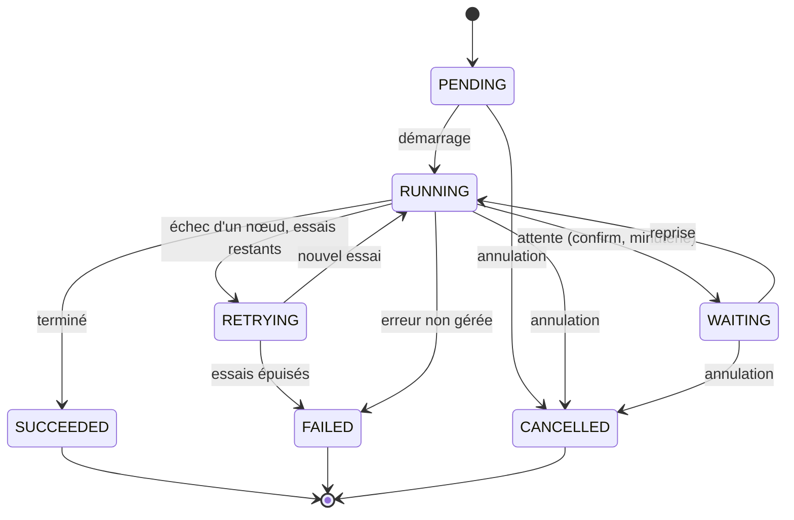
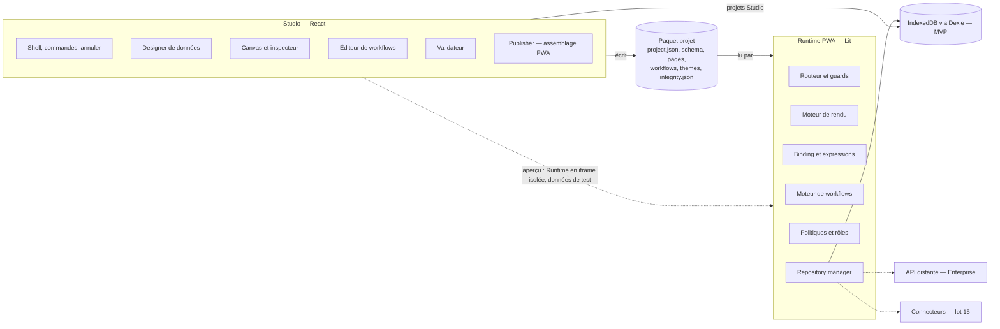

# App Canvas Studio — Dossier de création (Claude Code)

| Élément | Valeur |
| --- | --- |
| Auteur / commanditaire | David LARTIGUE — Responsable méthodes |
| Version | 1.0 (consolidation CDC v1.0 + DAD v1.0) |
| Date | 2 octobre 2026 |
| Emplacement attendu | `docs/dossier-creation.md` du dépôt `app-canvas-studio` |

## 0. Objet et mode d'emploi

Ce dossier consolide le cahier des charges (CDC v1.0) et le dossier d'architecture détaillé (DAD v1.0) d'App Canvas Studio en un référentiel unique, exécutable avec Claude Code. Il tranche les points laissés ouverts, corrige les incohérences entre les deux documents et fixe un plan de réalisation en lots livrables.

**Sources consolidées**

| Document | Version | Statut d'origine | Apport principal |
| --- | --- | --- | --- |
| Cahier des charges fonctionnel et technique | 1.0 du 2 octobre 2026 | Cadrage initial | Exigences EF/ET, règles RG, ENF, critères AC-01 à AC-10, lots 0 à 12 |
| Dossier d'Architecture Détaillée (Enterprise) | 1.0 du 2 octobre 2026 | Architecture cible à valider | Contrats, runtime, workflows, sécurité, ADR-001 à 010, lots L0 à L20 |

**Conventions de ce dossier**

- Les identifiants d'origine (EF-, ET-, RG-, ENF-, ARC-, SEC-, ADR-, AC-) sont conservés pour la traçabilité.
- Les ajouts de ce dossier portent le préfixe **D-** (décision à arbitrer) ou **REC-** (recommandation d'expert).
- « MVP » désigne le périmètre local/PWA sans backend (jalon J3 du DAD). « Enterprise » désigne tout ce qui suppose un serveur.

**Comment le lire**

- Relecteurs métier : sections 1, 2, 3 et 4. Les décisions de la section 3 sont à valider avant tout développement.
- Relecteurs techniques : sections 2, 3, 5 à 9.
- Réalisation avec Claude Code : sections 9, 10 et 11. Le `CLAUDE.md` de la section 11 se copie à la racine du dépôt ; chaque lot de la section 10 se lance avec le prompt type associé.

**Consignes de lecture pour Claude Code**

- Ce fichier est la référence fonctionnelle et technique du dépôt. En cas de conflit avec le CDC ou le DAD d'origine, ce fichier prévaut.
- Une décision de la section 3 au statut « À valider » s'applique **telle que recommandée** tant qu'un ADR ne la modifie pas. Ne pas rouvrir l'arbitrage ; signaler seulement un blocage concret.
- Une décision au statut « Validée » est définitive pour le MVP.
- Les identifiants (EF-, RG-, D-, REC-, AC-…) servent de références dans les analyses, les commits et les tests.
- Les seuils de la section 8.3 sont provisoires : les mesurer, ne pas les inventer autrement.

## 1. Synthèse du produit

App Canvas Studio est un atelier low-code piloté par métadonnées. Le Studio produit un manifeste de projet versionné ; un Runtime stable l'interprète pour exécuter une application métier web/PWA hors connexion. Aucun code n'est généré écran par écran (ADR-001).

**Problème résolu.** QualiFlow, PerFlow One DMAIC, SRC et MVC Canvas reconstruisent chacun les mêmes briques : saisie, tableaux de bord, plans d'action, droits, exports, stockage local, référentiels. Le Studio les capitalise une fois.

**Utilisateurs**

| Profil | Usage principal | Présent au MVP |
| --- | --- | --- |
| Concepteur fonctionnel | Modèle de données, écrans, règles, workflows, publication | Oui |
| Architecte / développeur socle | Runtime, composants, qualité technique | Oui |
| Designer / référent UX | Thèmes, composants, accessibilité | Oui |
| Testeur / recette | Scénarios, non-régression | Oui |
| Utilisateur final | Utilise l'application PWA publiée | Oui |
| Administrateur plateforme | Workspaces, membres, politiques, catalogues | Non (Enterprise) |
| Exploitant | Publication, sauvegarde, supervision | Partiel (publication statique) |

**Périmètre MVP retenu** (convergence CDC § Périmètre V1 et MoSCoW « Must », DAD jalons J1 à J3)

- Gestion de projets locale : création, catalogue, versions, import/export de paquet.
- Modélisation des données : entités, champs, relations 1-1, 1-N, N-N, contraintes, référentiels, données de test, migrations.
- Éditeur d'écrans responsive : canvas, arborescence, inspecteur, annuler/rétablir, copier/coller.
- Bibliothèque de composants V1 (structure, navigation, saisie, données, information, actions).
- Binding déclaratif, formules sûres, requêtes, états de données.
- Navigation : routes, menus conditionnels.
- Workflows événementiels avec conditions, boucles bornées, gestion d'erreur, journal.
- Rôles applicatifs (filtrage d'interface en mode local, voir section 2.2).
- Thèmes et jetons de design (clair, sombre, personnalisé).
- Validateur avant publication, publication d'une PWA installable hors connexion, export diagnostic.

**Hors MVP** : compilation native, SaaS multi-tenant, coédition temps réel, marketplace, connecteurs Microsoft 365, backend, synchronisation et partage des données entre postes (D-03), assistant IA, plugins tiers (voir D-05).

**Indicateurs de succès** (CDC § 1.4) : un utilisateur formé réalise une application CRUD depuis un projet vierge ; une modification de modèle ou de thème se répercute sans reprise manuelle ; la PWA fonctionne hors connexion ; un export se restaure sans perte ; les erreurs de configuration sont bloquées avant publication.

## 2. Analyse critique des deux documents

Les deux documents sont solides et alignés sur l'essentiel : métadonnées interprétées, offline-first, contrats, sécurité par conception. Ils ne sont pas encore exécutables tels quels : 9 incohérences entre eux, 4 trous fonctionnels majeurs et plusieurs choix techniques laissés ouverts bloqueraient Claude Code dès le lot 0.

### 2.1 Incohérences entre CDC et DAD

| # | Sujet | CDC | DAD | Résolution proposée |
| --- | --- | --- | --- | --- |
| I-01 | Découpage en lots | Lots 0 à 12 | L0 à L20, ordre différent (sécurité en L14 contre lot 6, import/export L12 contre lot 7) | Plan unique de la section 10, aligné sur les jalons du DAD |
| I-02 | Nom du produit | App Canvas Studio | App Canvas Studio Enterprise, qui cite un CDC « Enterprise » inexistant | Nom unique « App Canvas Studio » ; « Enterprise » = profil de déploiement |
| I-03 | Syntaxe des expressions | « DSL typé limité avec parseur dédié » (Q3) | Exemples en syntaxe type JavaScript (`==`, `&&`) | Sous-ensemble d'expressions type JS, parsé en AST, typé, interprété (D-04) |
| I-04 | Types de champs | 12 types dont « texte long », « choix » | 8 types ; « texte long » absent, « enum » lié à un dictionnaire | Liste unique de 13 types (section 6.3) ; texte long = `string` + indice d'affichage |
| I-05 | Relations N-N | Exigées (EF-DAT-02) | Aucune table de jonction ni comportement défini | Store de jonction généré, suppression en cascade sur la jonction uniquement |
| I-06 | Format du paquet | `/screens/*.json`, pas d'`integrity.json` | `entries.pages: screens/index.json`, `integrity.json`, `release.json` | Arborescence unique (section 6.1) |
| I-07 | Composition des écrans | Glisser, déplacer, redimensionner, aligner (EF-UI-01) | Arbre UI imbriqué, grilles responsive | Disposition en flux (conteneurs pile/grille), sans positionnement absolu (D-02) |
| I-08 | Machine d'états workflow | Non décrite | `FAILED -> RETRYING -> FAILED`, ambiguë | Machine corrigée (section 4.6) |
| I-09 | Habilitations Studio | Matrice Lecteur / Concepteur / Admin | Membres et rôles gérés par le Control Plane | Sans backend, le Studio est mono-utilisateur ; matrice reportée au profil Enterprise |

### 2.2 Trous fonctionnels majeurs

1. **Les données d'une PWA locale ne sont pas partagées.** Sans backend, chaque utilisateur final a sa propre base IndexedDB dans son navigateur. Un audit saisi sur une tablette n'est pas visible sur le poste du manager. Ni le CDC ni le DAD ne l'écrivent. C'est la limite n°1 du MVP et elle conditionne la valeur métier. Décision D-03 : elle est acceptée pour le MVP et levée au jalon J4.
2. **Les rôles en mode local ne protègent rien.** Le CDC le dit lui-même (§ 7.5 : « le masquage d'interface ne constitue pas une sécurité »). En local, les rôles sont du confort d'interface. Il faut l'afficher clairement aux concepteurs.
3. **Où la PWA publiée est hébergée n'est pas dit.** Une PWA exige HTTPS et un serveur web. Le Publisher doit produire un dossier statique déployable (IIS, Nginx, partage intranet HTTPS). Sans hébergeur identifié, AC-06 n'est pas démontrable.
4. **Le risque d'éviction du stockage navigateur est absent.** Safari peut effacer les données d'un site non installé après 7 jours sans visite ; tous les navigateurs peuvent évincer sous pression disque. Il faut demander le stockage persistant (`navigator.storage.persist()`), pousser l'installation PWA et rappeler l'export de sauvegarde (REC-01).

### 2.3 Points techniques laissés ouverts qui bloquent le démarrage

- Framework du Studio (CDC Q2, DAD A1) : à trancher avant le lot 0, pas « après prototype », sinon Claude Code n'a pas de socle (D-01).
- Représentation des décimaux (A4) : décision nécessaire avant le repository (D-07).
- Moteur de graphe pour l'éditeur de workflows (A5) : décision nécessaire avant le lot workflows (D-08).
- Budgets de performance : le DAD refuse à juste titre d'inventer des seuils, mais Claude Code a besoin de cibles testables. Ce dossier propose des **seuils provisoires** à confirmer au jalon J1 (section 8.3).

### 2.4 Recommandations d'expert

| Code | Recommandation | Justification |
| --- | --- | --- |
| REC-01 | Stockage persistant demandé au premier lancement, indicateur visible, rappel d'export périodique | Protège contre l'éviction navigateur (2.2 point 4) |
| REC-02 | Annuler/rétablir par patchs Immer (`produceWithPatches`) encapsulés dans des commandes | Patch inverse calculé automatiquement : moins de code `undo()` à écrire et à tester qu'avec ARC-STU-02 seul |
| REC-03 | Schémas écrits en TypeBox : un seul source donne le JSON Schema (validation Ajv) et les types TypeScript | Évite la dérive entre schéma publié et types (ET-FMT-01) |
| REC-04 | Pas de plugin tiers exécutable au MVP ; seuls les composants première partie, compilés dans le Runtime | Un vrai sandbox JavaScript navigateur (iframe isolée + messages) est un chantier à part entière ; ET-PLG-02 reste respecté par absence |
| REC-05 | Prévisualisation du Studio dans une iframe isolée, avec base IndexedDB dédiée aux données de test | Sépare conception et exécution, applique RG-04 par construction |
| REC-06 | Bases IndexedDB nommées par projet et par environnement : `acs-data-{projectKey}-{env}` | Isolation des données, purge ciblée, aucun mélange test/production |
| REC-07 | « Signature » au MVP = empreintes SHA-256 dans `integrity.json` ; signature cryptographique reportée (A6) | Le pipeline du DAD mentionne la signature sans PKI définie |
| REC-08 | Minuterie de workflow exécutée uniquement application ouverte | Une PWA n'a pas d'exécution de fond fiable ; le CDC EF-WF-01 doit le préciser |
| REC-09 | Impression et PDF par feuille de style d'impression et `window.print()` au MVP | Couvre EF-EXP-02 sans bibliothèque PDF lourde |
| REC-10 | Chaque contrôle de qualification doit pouvoir échouer si la fonctionnalité qu'il protège est retirée (test négatif obligatoire) | Règle déjà appliquée sur QualiFlow ; évite les contrôles qui mesurent des noms de fichiers plutôt qu'un comportement |

## 3. Décisions à arbitrer avant développement

Douze décisions doivent être validées avant le lot 0 ; D-01, D-02 et D-03 sont structurantes et difficiles à inverser. D-03 est validée (option A) ; les onze autres restent à arbitrer. Le reste du dossier est rédigé en appliquant les recommandations ci-dessous ; une décision modifiée entraîne la mise à jour des sections citées.

| N° | Sujet | Options | Recommandation | Bloque | Statut |
| --- | --- | --- | --- | --- | --- |
| D-01 | Framework du Studio | A : React 19 pour le Studio, Lit pour les composants du Runtime. B : Lit partout. | **A.** L'éditeur (canvas, inspecteur, graphe) profite de l'écosystème React (dnd-kit, React Flow, Zustand). Les composants restent des Web Components Lit (ADR-002), donc le Runtime ne dépend pas de React. B est viable mais impose de réécrire graphe et glisser-déposer. | Lot 0 | À valider |
| D-02 | Modèle de disposition des écrans | A : flux (conteneurs pile et grille). B : positionnement libre absolu. C : hybride. | **A.** Seul A est responsive par construction (EF-UI-04, ENF-04). « Redimensionner » = largeur ou nombre de colonnes par point de rupture ; « aligner » = propriétés du conteneur. | Lots 3, 7 | À valider |
| D-03 | Partage des données entre utilisateurs au MVP | A : local strict, échange par export/import de fichier. B : backend minimal de synchronisation avant J3. | **A**, limite affichée aux concepteurs, backend au jalon J4. Question tranchée le 2 octobre 2026 : la première application cible exige-t-elle un partage multi-postes ? Non : option A retenue ; le partage multi-postes arrive avec le backend et la synchronisation (lots 17 et 18). | Périmètre MVP | Validée |
| D-04 | Moteur d'expressions | A : sous-ensemble type JS parsé par jsep, vérificateur de types et interpréteur maison. B : DSL et parseur entièrement maison. | **A.** Syntaxe familière, parseur maintenu (licence MIT), aucun `eval` (RG-05, ARC-EXP-01). | Lot 8 | À valider |
| D-05 | Plugins tiers au MVP | A : aucun, composants première partie uniquement. B : plugins en iframe isolée. | **A** (REC-04). Le manifeste de plugin est spécifié mais non chargé. | Lot 3 | À valider |
| D-06 | Hébergement de la PWA publiée | Serveur statique HTTPS intranet (IIS, Nginx), hébergement cloud privé | Dossier statique déployable sur tout serveur HTTPS ; serveur cible à nommer par l'exploitant. | Lot 13, AC-06 | À valider |
| D-07 | Format des décimaux (DAD A4) | A : chaîne canonique + échelle par champ, calcul avec big.js. B : `number` JavaScript. | **A.** Pas d'erreur d'arrondi sur montants et indicateurs ; tri via clé d'index normalisée. | Lot 4 | À valider |
| D-08 | Graphe de l'éditeur de workflows (DAD A5) | @xyflow/react, rendu maison | **@xyflow/react** (MIT), doublé d'une vue liste éditable au clavier pour l'accessibilité. | Lot 10 | À valider |
| D-09 | Bibliothèque IndexedDB | Dexie.js, idb | **Dexie.js** : transactions, index composés, migrations de version, requêtes réactives. | Lot 4 | À valider |
| D-10 | Chiffrement des données locales (DAD A7) | A : classification des champs au MVP, chiffrement AES-GCM en lot dédié. B : chiffrement dès le MVP. C : jamais. | **A.** Le champ porte dès le départ `classification: public / interne / sensible` ; le chiffrement WebCrypto des champs sensibles arrive au lot 14. | Lot 4 | À valider |
| D-11 | Matrice navigateurs (ENF-03, A9) | À définir | Chrome et Edge (2 dernières versions), Firefox (courante et ESR), Safari 17 et plus (macOS, iOS). Tests automatisés sur Chromium, Firefox et WebKit. | Lot 0 | À valider |
| D-12 | Nom, licence, diffusion (CDC Q1, Q7) | — | Nom de travail conservé, usage interne, code propriétaire ; vérifier les licences des dépendances (MIT, Apache 2.0, BSD uniquement). | Avant diffusion | À valider |

## 4. Spécification fonctionnelle consolidée

Les 45 exigences fonctionnelles du CDC sont reprises ; chacune porte une précision qui la rend testable et le lot qui la livre. Les lots renvoient au plan de la section 10.

### 4.1 Parcours de référence

1. Créer un projet vierge ou depuis un modèle.
2. Définir identité, thème et paramètres.
3. Construire le modèle de données et saisir des données de test.
4. Composer les écrans et la navigation.
5. Définir binding, règles et workflows.
6. Prévisualiser (formats, rôles, réseau), corriger les erreurs du validateur.
7. Figer une version (immuable), publier la PWA, exporter le paquet.
8. Faire évoluer : nouvelle version brouillon, plan de migration, recette, publication, retour arrière possible.

### 4.2 Exigences consolidées et critères d'acceptation

| ID | Exigence | Précision et critère d'acceptation | Lot |
| --- | --- | --- | --- |
| EF-PRJ-01 | Création de projet | Métadonnées : `id` UUID v7, `key` (majuscules, 2 à 16 car., unique), nom, description, auteur, version SemVer, langue, thème, mode de stockage. Projet créé et rouvert après rechargement. | 5 |
| EF-PRJ-02 | Catalogue de projets | Recherche, filtre, tri, duplication (nouveaux identifiants), archivage, suppression logique avec corbeille 30 jours. | 5 |
| EF-PRJ-03 | Historique et versions | Version publiée immuable (RG-03) : notes, auteur, date, état, `runtime.minVersion`, empreinte. Toute modification d'une version publiée est refusée. | 12 |
| EF-PRJ-04 | Import et export | Paquet `.acs.zip` (section 6.1). AC-07 : export, suppression locale, réimport, comparaison structurelle identique. | 12 |
| EF-PRJ-05 | Modèles de départ | CRUD, audit, plan d'actions, formulaire, tableau de bord, workflow de validation, livrés comme paquets valides. | 14 |
| EF-DAT-01 | Entités et champs | 13 types (section 6.3). Renommer le libellé ne change pas la clé ; supprimer un champ référencé déclenche l'analyse d'impact (RG-02). | 6 |
| EF-DAT-02 | Relations | 1-1, 1-N, N-N (store de jonction généré). `onDelete` : `restrict` (défaut), `cascade`, `setNull`. Test : suppression bloquée en `restrict` avec message listant les dépendants. | 4, 6 |
| EF-DAT-03 | Contraintes | Obligatoire, défaut, unicité (index unique), min, max, regex (longueur bornée, test anti-ReDoS), liste de valeurs. Contrôlées dans le repository, pas seulement dans le formulaire. | 4 |
| EF-DAT-04 | Données de référence | Entité typée `business`, `parameter` ou `dictionary`. Import CSV avec rapport ligne par ligne. | 6 |
| EF-DAT-05 | Migration de schéma | Toute modification structurante produit un plan (opérations, destructive oui/non, réversible oui/non). Publication bloquée si plan destructif non validé (RG-09). | 6 |
| EF-DAT-06 | Jeux de données de test | Base séparée `acs-data-{key}-test` ; jamais exportée comme production sans case explicite (RG-04). | 4 |
| EF-UI-01 | Canvas visuel | Disposition en flux (D-02) : glisser depuis la palette, déplacer dans l'arbre, dupliquer, supprimer ; largeur par point de rupture. Retour visuel en moins de 100 ms. | 7 |
| EF-UI-02 | Arborescence | Hiérarchie synchronisée avec le canvas, réordonnancement clavier et souris, verrouillage d'un nœud. | 7 |
| EF-UI-03 | Inspecteur | Onglets Contenu, Style, Disposition, Données, Accessibilité, Visibilité, Événements. Formulaire généré depuis le `propsSchema` du composant. | 7 |
| EF-UI-04 | Responsive | 3 points de rupture : mobile moins de 600 px, tablette 600 à 1023 px, bureau 1024 px et plus. Surcharge de propriétés par point de rupture. Utilisable dès 360 px (ENF-04). | 3, 7 |
| EF-UI-05 | Prévisualisation | Iframe isolée (REC-05) : 3 formats, choix du rôle, états de données (vide, erreur, chargé), simulation hors connexion. AC-05. | 7, 11 |
| EF-UI-06 | Annuler / rétablir | Pile de 200 commandes minimum par projet ouvert, couvrant toutes les commandes de conception (AC-A05). | 5 |
| EF-UI-07 | Copier / coller | Identifiants régénérés, références internes réécrites, liaisons vers des objets absents signalées et retirées. | 7 |
| EF-CMP-01 | Contrat de composant | `ComponentDefinition` (section 7.3) validé à l'enregistrement. Test de contrat générique exécuté sur chaque composant. | 3 |
| EF-CMP-02 | Composants composés | Sous-arbre paramétrable, sans privilège supplémentaire. | 16 |
| EF-CMP-03 | Compatibilité | Composant déprécié signalé (avertissement), migration avec diff annulable. | 3 |
| EF-BND-01 | Binding déclaratif | Contextes `app`, `user`, `route`, `page`, `record`, `item`, `form`, `workflow` (DAD § 8.3). | 8 |
| EF-BND-02 | Formules | AST + interpréteur, fonctions en liste blanche, typées et documentées ; budgets profondeur 32, 10 000 nœuds évalués, 50 ms. AC-A06. | 8 |
| EF-BND-03 | Requêtes | `QuerySpec` : filtre, tri, recherche texte, pagination, agrégation (count, sum, avg, min, max), projection ; aperçu du résultat dans l'inspecteur. | 4, 8 |
| EF-BND-04 | États | Chargement, vide, erreur, hors connexion, accès refusé : rendu par défaut fourni par chaque composant de données, personnalisable. | 9 |
| EF-NAV-01 | Routes | Écran initial obligatoire, paramètres typés, redirections, page 404. | 2 |
| EF-NAV-02 | Menus conditionnels | Visibilité par expression (rôle, contexte, point de rupture). | 11 |
| EF-NAV-03 | Liens profonds | URL `/#/route/param` ouvrant l'enregistrement ; refus propre si absent. | 2 |
| EF-WF-01 | Déclencheurs | MVP : clic, création, modification, suppression, ouverture d'écran, minuterie (application ouverte, REC-08), import. Synchronisation et connecteur : post-MVP. | 10 |
| EF-WF-02 | Actions | Nœuds V1 (section 4.6). | 10 |
| EF-WF-03 | Conditions | if, switch, foreach borné (1 000 itérations par défaut), try/catch. AC-04. | 10 |
| EF-WF-04 | Éditeur visuel | Graphe + vue liste accessible (D-08). Validation : nœud orphelin, cycle hors boucle, entrée manquante. | 10 |
| EF-WF-05 | Journal d'exécution | Étape, statut, durée, entrées et sorties avec champs `sensible` masqués, erreur. Conservation 30 jours ou 10 000 entrées. | 10 |
| EF-SEC-01 | Profils | Rôles applicatifs avec droits sur écrans, actions, entités, champs (lecture, écriture). En local : filtrage d'interface et contrôle dans le repository, sans valeur de sécurité (section 2.2). | 11 |
| EF-SEC-02 | Contexte utilisateur | Port `IdentityProvider` ; adaptateur local au MVP, OIDC en Enterprise. | 2, 11 |
| EF-SEC-03 | Mode local | Profil local nommé, bandeau « Mode local — non sécurisé » visible en permanence. | 11 |
| EF-SEC-04 | Secrets | Aucun champ de type secret dans le manifeste ; référence logique `secretRef` uniquement. Contrôle bloquant au validateur et à l'export (AC-A10). | 1, 13 |
| EF-THM-01 | Jetons de design | Couleurs, typographies, espacements, rayons, ombres, densité, états ; exposés en variables CSS. | 2 |
| EF-THM-02 | Thèmes multiples | Clair, sombre, personnalisé ; contrôle de contraste 4,5:1 (texte) et 3:1 (éléments d'interface) dans l'éditeur. | 7 |
| EF-THM-03 | Charte de marque | Logo, icône, palette ; AC-09 : un changement de jeton se répercute sur tous les écrans sans autre action. | 7 |
| EF-FIL-01 | Médias | Types autorisés (PNG, JPEG, WebP, SVG assaini, PDF), 5 Mo par fichier par défaut, nom de stockage aléatoire. | 12 |
| EF-FIL-02 | Pièces jointes | Blob IndexedDB + métadonnées, quota affiché. | 9 |
| EF-EXP-01 | Export de données | CSV (UTF-8 avec BOM, séparateur `;`, neutralisation des formules `=+-@`) ; Excel optionnel. | 14 |
| EF-EXP-02 | Impression | Feuille de style d'impression par écran (REC-09). | 14 |
| EF-AI-01 à 03 | Assistant IA | Post-MVP (lot 20). | 20 |

### 4.3 Règles de gestion

RG-01 à RG-10 du CDC s'appliquent sans changement. Ce dossier ajoute :

| Code | Règle |
| --- | --- |
| RG-11 | Une clé lisible (`key`) respecte `^[a-z][a-zA-Z0-9_]{0,63}$` pour entités, champs, pages et workflows ; `^[A-Z][A-Z0-9]{1,15}$` pour un projet. |
| RG-12 | Une seule version « brouillon » modifiable par projet ; les autres versions sont en lecture seule. |
| RG-13 | La sauvegarde automatique se déclenche 2 secondes après la dernière commande, uniquement si la validation structurelle passe ; sinon l'état est conservé en brouillon de récupération. |
| RG-14 | Toute action destructive affiche le nombre et la liste des objets impactés avant confirmation. |
| RG-15 | Une application publiée en mode local affiche son état de stockage (persistant ou non) et la date du dernier export de données. |

### 4.4 Rôles du Studio

Au MVP, le Studio est mono-utilisateur local : toutes les actions sont ouvertes au concepteur. La matrice Lecteur / Concepteur / Administrateur du CDC § 2.1 est conservée pour le profil Enterprise (lot 17), où elle sera appliquée côté serveur.

### 4.5 Bibliothèque de composants

| Famille | Composants | Lot |
| --- | --- | --- |
| Structure | Page, section, conteneur pile, grille, onglets, panneau latéral, accordéon | 3 |
| Navigation | Menu, barre d'onglets, fil d'Ariane, bouton retour, lien | 3 |
| Information | Texte, titre, badge, alerte, carte, indicateur, progression | 3 |
| Actions | Bouton, menu d'actions, confirmation, notification | 3 |
| Saisie | Texte, zone de texte, nombre, date, choix, interrupteur, fichier, image, signature simple | 9 |
| Données | Liste, tableau (virtualisé), fiche, formulaire, détail, pagination, recherche, filtre | 9 |
| Export | Bouton d'export CSV, impression | 14 |
| Métier | Kanban simple, checklist, timeline, pièces jointes, commentaires locaux, graphiques ECharts | 16 |

### 4.6 Workflows : nœuds V1 et cycle de vie

| Famille | Nœuds MVP | Post-MVP |
| --- | --- | --- |
| Contrôle | start, end, if, switch, foreach borné, try/catch | attente longue persistante |
| Données | get, query, create, update, delete | — |
| Interface | navigate, notify, confirm, setState | — |
| Transformation | map, format, calculate, validate | — |
| Fichier | createExport (CSV), attach, download | export Excel/PDF |
| Externe | — | connectorCall, webhook (lot 15) |



Un `try/catch` transforme un échec en branche de reprise au lieu de mener à FAILED.

Cette machine remplace celle du DAD § 10.2 : RETRYING revient à RUNNING tant qu'il reste des essais, et seul l'épuisement des essais mène à FAILED. WAITING couvre `confirm` et la minuterie ; une exécution en attente est persistée et reprise au redémarrage de l'application.

## 5. Architecture cible consolidée

Le Studio (React) écrit un paquet projet déclaratif ; le Runtime (Web Components Lit) le lit et l'exécute derrière des ports. Au MVP, la publication est un **assemblage**, pas une compilation : le Runtime est pré-construit et versionné, le Publisher y ajoute le paquet, le manifeste PWA, le service worker et les empreintes. Tout se fait dans le navigateur, sans serveur de build.



Le paquet projet est le seul contrat entre Studio et Runtime ; les adaptateurs en pointillé respectent déjà le port Repository mais ne sont pas livrés au MVP.

### 5.1 Principes retenus

Les 8 principes du DAD sont conservés (séparation Studio/Runtime, paquet portable sans secret, offline-first, hexagonal, Web Components, commandes et événements, sécurité serveur, migrations explicites). Trois précisions s'y ajoutent :

- **Frontières vérifiées par l'outillage.** Les dépendances autorisées entre paquets (DAD § 3.2) sont codées dans dependency-cruiser et bloquent la CI.
- **Routage par hash** (`/#/route`). La PWA publiée fonctionne sur n'importe quel serveur statique sans règle de réécriture, ce qui simplifie D-06.
- **Aucune évaluation dynamique de code, y compris dans les bibliothèques.** La CSP interdit `unsafe-eval`. Ajv compile par `new Function` : il n'est utilisé qu'en mode *standalone* (code de validation généré au build) pour les schémas du manifeste. Les règles des entités, dynamiques, sont validées par un validateur interprété maison.

### 5.2 Stack technique

| Domaine | Choix | Justification |
| --- | --- | --- |
| Langage | TypeScript en mode `strict`, ES2022 | Contrats typés (ENF-06) |
| Monorepo | pnpm workspaces, Node.js LTS courant | Installation verrouillée, espace disque réduit |
| Build | Vite | Rapide, standard, mode bibliothèque pour les paquets |
| Studio | React 19, Zustand + Immer, dnd-kit, react-aria-components | État normalisé (ARC-STU-01), patchs inverses (REC-02), glisser-déposer accessible, arbre et menus accessibles |
| Graphe de workflows | @xyflow/react | D-08 |
| Composants Runtime | Lit 3 (Web Components) | ADR-002 ; déjà maîtrisé sur PerFlow One |
| Schémas | TypeBox + Ajv standalone | REC-03, compatible CSP stricte |
| Expressions | jsep + vérificateur de types et interpréteur maison | D-04, RG-05 |
| Stockage | Dexie.js 4 sur IndexedDB | D-09 |
| Décimaux | big.js | D-07 |
| Dates | Chaînes ISO 8601, date-fns | Fuseau explicite (DAD § 7.3) |
| Paquets ZIP | fflate | Léger, sans dépendance native |
| Empreintes, chiffrement | WebCrypto (SHA-256, AES-GCM, PBKDF2) | Natif navigateur |
| PWA du Studio | vite-plugin-pwa | Service worker du Studio lui-même |
| PWA publiée | Service worker généré par le Publisher depuis un gabarit | Liste de pré-cache calculée par release, activation atomique |
| Graphiques | ECharts encapsulé dans un composant Lit | Lot 16 |
| Tests | Vitest, fake-indexeddb, Playwright (Chromium, Firefox, WebKit), axe-core | Section 9.4 |
| Qualité | ESLint (typescript-eslint), Prettier, dependency-cruiser, CycloneDX (SBOM), osv-scanner | Quality gates du DAD § 18.3 |

Toutes ces dépendances sont sous licence MIT, Apache 2.0 ou BSD. Les versions exactes sont figées dans le lockfile au lot 0.

### 5.3 Frontières de confiance

Les 5 frontières du DAD § 2.3 sont conservées. Au MVP, les deux actives sont **l'import de paquet** (contrôles SEC-01) et **le poste local** (classification, stockage persistant, purge). Les frontières client/API et connecteur s'activent avec le profil Enterprise.

## 6. Modèle de données

Deux modèles coexistent : le **manifeste** (ce que le concepteur décrit, exporté dans le paquet) et le **stockage** (où le Studio et chaque application rangent leurs données). Le manifeste ne contient jamais de données métier réelles ni de secret.

### 6.1 Paquet projet `.acs.zip`

```text
project.json              manifeste racine (manifestVersion, project, runtime, entries, dependencies)
schema/entities.json      entités, champs, relations, index, dictionnaires
schema/roles.json         rôles et politiques
pages/index.json          routes, écran initial, menus
pages/{pageId}.json       une page = arbre UI normalisé
workflows/{wfId}.json     un workflow
queries/index.json        requêtes nommées
themes/{themeId}.json     jetons et modes
assets/{hash}.{ext}       médias, nom = empreinte
migrations/{n}.json       migrations de données versionnées
testdata/{entity}.json    jeux de test (optionnel, exclus par défaut)
integrity.json            inventaire + SHA-256 de chaque fichier
README.md                 généré : nom, version, compatibilité
```

Règles d'import (SEC-01) : taille totale 100 Mo maximum, 2 000 fichiers maximum, chemins normalisés et refus de `..`, `/` initial ou caractères de contrôle (zip-slip), extension et type vérifiés, empreintes recalculées, schémas validés, puis quarantaine (aperçu des conflits) avant écriture.

### 6.2 Objets du manifeste

| Objet | Attributs principaux | Remarques |
| --- | --- | --- |
| Project | `id`, `key`, `name`, `description`, `author`, `version`, `locale`, `defaultThemeId`, `storageMode` | `storageMode` : `local` au MVP |
| ProjectVersion | `semver`, `status` (`draft`, `frozen`, `published`, `archived`), `manifestVersion`, `checksum`, `notes`, `publishedAt` | Immuable dès `frozen` (RG-03) |
| Entity | `id`, `key`, `label`, `kind` (`business`, `parameter`, `dictionary`), `fields`, `indexes`, `classification` | Une entité = un store IndexedDB |
| Field | `id`, `key`, `label`, `type`, `required`, `default`, `unique`, `validators`, `classification`, `ui` | Voir 6.3 |
| Relation | `id`, `source`, `target`, `cardinality` (`1-1`, `1-N`, `N-N`), `onDelete` | N-N : store de jonction |
| Query | `id`, `key`, `source`, `filter` (FilterSpec indexable), `where` (expression), `sort`, `page`, `projection`, `aggregate` | Nommée, réutilisable |
| Page | `id`, `key`, `route`, `params`, `rootNodeId`, `guards`, `nodes` (map par id) | Arbre normalisé (DAD annexe A) |
| UINode | `id`, `component` (`famille.nom@majeure`), `props`, `responsive` (surcharges par point de rupture), `bindings`, `events`, `visibleWhen`, `children`, `locked` | Les enfants sont des identifiants |
| Workflow | `id`, `key`, `trigger`, `nodes`, `edges`, `variables`, `errorPolicy`, `logLevel` | Voir 4.6 |
| Theme | `id`, `name`, `tokens`, `modes` (`light`, `dark`), `assets` | Jetons en variables CSS |
| Role | `id`, `key`, `label`, `permissions` (écrans, actions, entités, champs) | Politique déclarative |
| SecretRef | `id`, `key`, `description` | Référence seule, jamais de valeur |

### 6.3 Types de champs (13)

| Type | Stockage | Composant par défaut | Règles |
| --- | --- | --- | --- |
| `string` | string | Texte | Longueur max 255 par défaut, regex optionnelle |
| `text` | string | Zone de texte | Longueur max 10 000 |
| `integer` | number | Nombre | Entier sûr (±2^53) |
| `decimal` | string canonique | Nombre | `precision` et `scale` obligatoires, calcul big.js (D-07) |
| `boolean` | boolean | Interrupteur | `nullable` configurable |
| `date` | string `YYYY-MM-DD` | Date | Sans fuseau |
| `datetime` | string ISO 8601 UTC | Date et heure | Affichage dans le fuseau de l'utilisateur |
| `choice` | string | Choix | Référence à un dictionnaire ou liste fixe |
| `multiChoice` | string[] | Choix multiple | Idem |
| `reference` | string (id) | Sélecteur | Intégrité vérifiée par le repository |
| `file` | id vers `_files` | Fichier | Type et taille contrôlés |
| `image` | id vers `_files` | Image | Idem + miniature |
| `json` | object | — | Schéma JSON recommandé |

Exemple de champ :

```json
{ "id": "0192f1c4-...", "key": "dueDate", "label": "Échéance", "type": "date",
  "required": true, "classification": "interne",
  "validators": [{ "kind": "expression", "expr": "value >= today()", "message": "L'échéance doit être future" }] }
```

### 6.4 Stockage IndexedDB

| Base | Stores | Contenu |
| --- | --- | --- |
| `acs-studio` | `projects`, `versions`, `files`, `releases`, `backups`, `audit`, `settings`, `recovery` | Projets du Studio, fichiers du manifeste par version, sauvegardes avant migration |
| `acs-data-{key}-{env}` (`env` = `test`, `prod`) | `e_{entity}` par entité, `j_{relation}` par N-N, `_files`, `_wfRuns`, `_wfLogs`, `_meta`, `_outbox` | Données d'une application publiée ou de l'aperçu |

Enveloppe de chaque enregistrement : `id` (UUID v7, triable par date), `_v` (version de ligne, incrémentée à chaque écriture, contrôle optimiste `expectedVersion`), `_createdAt`, `_updatedAt`, `_createdBy`, `_updatedBy`, puis les champs métier par `key`. `_outbox` est créé vide au MVP pour que la synchronisation (lot 18) n'exige pas de migration.

### 6.5 Migrations

| Niveau | Mécanisme | Garanties |
| --- | --- | --- |
| Manifeste | Fonctions pures `migrate_v{n}_to_v{n+1}` enchaînées à l'ouverture | Une fixture par version ancienne ; le Runtime refuse un manifeste plus récent (`MANIFEST_UNSUPPORTED`) |
| Données métier | Plan généré par diff de schéma : `addEntity`, `addField`, `addIndex`, `addRelation`, `changeType` (avec convertisseur), `removeField` et `removeEntity` (destructifs) | Sauvegarde automatique avant opération destructive (RG-09), état enregistré dans `_meta`, reprise idempotente |
| Composant | `ComponentMigration` par version majeure | Diff affiché et annulable (DAD § 9.5) |

Renommer le libellé d'un champ ne produit aucune migration ; renommer sa clé est une opération `renameField` explicite.

## 7. Contrats internes et intégrations

Au MVP, il n'y a pas d'API HTTP : les « API » sont les ports TypeScript entre modules. Ils sont publiés dans `packages/domain` et `packages/component-sdk`, versionnés en SemVer, et toute rupture exige une version majeure plus une migration. Les adaptateurs Enterprise implémenteront les mêmes ports.

### 7.1 Repository et requêtes

```typescript
export interface Repository<T extends RecordEnvelope> {
  get(id: Id): Promise<T | null>;
  query(spec: QuerySpec): Promise<Page<T>>;
  save(input: Draft<T>, expectedVersion?: number): Promise<Result<T, DomainError>>;
  delete(id: Id, expectedVersion?: number): Promise<Result<void, DomainError>>;
  transaction<R>(work: (uow: UnitOfWork) => Promise<R>): Promise<R>;
  observe(spec: QuerySpec): Observable<Page<T>>; // ajout : rafraîchit les composants liés
}

export interface QuerySpec {
  source: EntityKey;
  filter?: FilterSpec;                 // structuré { and: [{ field, op, value }] } : utilise les index
  where?: ExpressionSource;            // post-filtre en mémoire, pour les cas non indexables
  search?: { text: string; fields: FieldKey[] };
  sort?: Array<{ field: FieldKey; dir: 'asc' | 'desc' }>;
  page?: { size: number; cursor?: string };   // taille max 500
  projection?: FieldKey[];
  aggregate?: Array<{ fn: 'count' | 'sum' | 'avg' | 'min' | 'max'; field?: FieldKey; as: string }>;
}
```

`save` et `delete` renvoient un `Result` plutôt que de lever une exception : les erreurs métier (contrainte, conflit de version, refus de politique) sont des valeurs typées que le workflow peut brancher.

### 7.2 Commandes et événements du Studio

```typescript
export interface DesignCommand<P = unknown> {
  type: `CMD-${string}`;        // CMD-UI-ADD, CMD-SCHEMA-RELATE, ...
  payload: P;
  label: string;                // affiché dans l'historique annuler
}
// Exécution : produceWithPatches(state, draft => handler(draft, payload))
// -> { patches, inversePatches } empilés ; undo = applyPatches(state, inversePatches)
```

Toute modification du projet passe par le bus de commandes ; aucun composant du Studio ne modifie l'état directement. Les événements (`EVT-PROJECT-SAVED`, `EVT-SCHEMA-CHANGED`, ...) sont émis après application et consommés par le validateur incrémental et l'autosave.

### 7.3 Contrat de composant

```typescript
export interface ComponentDefinition {
  id: string;                    // 'data.list'
  version: string;               // SemVer ; référencé dans le manifeste par majeure : 'data.list@1'
  category: 'structure' | 'navigation' | 'input' | 'data' | 'info' | 'action' | 'business';
  tag: string;                   // élément Lit enregistré : 'acs-data-list'
  propsSchema: TSchema;          // TypeBox ; génère le formulaire de l'inspecteur
  events: EventDefinition[];
  slots?: SlotDefinition[];      // contraintes d'imbrication pour le glisser-déposer
  bindings?: BindingDefinition[];
  capabilities: Capability[];    // data.read, data.write, files.read ... refusées par défaut
  accessibility: { role: string; nameFrom: string; keyboard: string[]; requiredProps: string[] };
  responsive?: string[];         // props surchargeables par point de rupture
  migrations?: ComponentMigration[];
  deprecated?: { since: string; replacement?: string };
}
```

Un composant ne fait aucun I/O : il reçoit ses données par binding et émet des événements que le Runtime convertit en commandes (DAD § 3.2).

### 7.4 Identité

```typescript
export interface IdentityProvider {
  current(): Promise<UserContext | null>;
  signIn(): Promise<UserContext>;
  signOut(): Promise<void>;
  readonly kind: 'local' | 'oidc';
}
export interface UserContext { id: string; displayName: string; roles: RoleKey[]; attributes: Record<string, string>; locale: string }
```

### 7.5 Fonctions du moteur d'expressions (liste blanche initiale)

| Famille | Fonctions |
| --- | --- |
| Logique | `if`, `coalesce`, `isEmpty`, `in` |
| Texte | `concat`, `upper`, `lower`, `trim`, `contains`, `startsWith`, `len`, `format` |
| Nombres | `round`, `floor`, `ceil`, `abs`, `min`, `max`, `sum`, `avg` (décimales via big.js) |
| Dates | `today`, `now`, `dateAdd`, `dateDiff`, `year`, `month`, `day`, `formatDate` |
| Collections | `count`, `first`, `last`, `map`, `filter` (bornés) |
| Contexte | `hasRole`, `isOnline` |

Chaque fonction déclare signature, type de retour, description en français et exemples ; les exemples sont exécutés comme tests.

### 7.6 Connecteurs (spécifiés au MVP, livrés au lot 15)

Le contrat d'opération du DAD § 11.2 est repris tel quel (`inputSchema`, `outputSchema`, `timeoutMs`, `retry`, `idempotent`), complété par `auth: { secretRef }` et `simulate: exemple de réponse` pour l'aperçu. Un connecteur ne modifie jamais le manifeste.

### 7.7 Erreurs

Toutes les erreurs suivent `{ code, message, details?, correlationId }`. Le catalogue du DAD (annexe C) est repris et complété :

| Code | Situation | Comportement |
| --- | --- | --- |
| `CONSTRAINT_VIOLATION` | Champ obligatoire, unicité, min/max, regex | Erreur liée au champ dans le formulaire |
| `VERSION_CONFLICT` | `expectedVersion` différente | Rechargement proposé, aucune écriture |
| `REFERENCE_BLOCKED` | Suppression en `restrict` avec dépendants | Liste des dépendants affichée |
| `EXPRESSION_INVALID` | Erreur de syntaxe ou de type | Signalée au validateur avec position |
| `EXPRESSION_BUDGET` | Profondeur, taille ou durée dépassée | Évaluation interrompue, valeur nulle |
| `STORAGE_QUOTA` | Quota navigateur atteint | Alerte et proposition d'export |
| `PKG_INTEGRITY` | Empreinte invalide à l'import | Refus, fichier fautif nommé |

## 8. Sécurité, données personnelles, performance, exploitation

Au MVP, la sécurité repose sur trois piliers vérifiables : aucune exécution de code venant d'un projet, un import de paquet méfiant, et l'absence de secret dans tout ce qui sort du poste. Les 10 contrôles SEC du DAD sont repris avec leur portée réelle au MVP.

### 8.1 Contrôles de sécurité

| Code | Surface | MVP | Test qui doit échouer si le contrôle est retiré |
| --- | --- | --- | --- |
| SEC-01 | Import de paquet | Oui (6.1) | Paquet avec `../evil.js`, paquet de 101 Mo, empreinte modifiée : tous refusés |
| SEC-02 | XSS | Oui | Texte `` dans un champ : affiché comme texte, aucun script ; SVG importé nettoyé |
| SEC-03 | Expressions | Oui | `constructor.constructor('...')()`, `__proto__`, `globalThis` : refusés à l'analyse |
| SEC-04 | API serveur | Enterprise | — |
| SEC-05 | Fichiers | Oui (type, taille, nom aléatoire) ; antivirus en Enterprise | Fichier `.html` renommé `.png` : refusé par vérification de signature |
| SEC-06 | Secrets | Oui (références uniquement) | Manifeste contenant un champ `password` ou une chaîne type jeton : export bloqué |
| SEC-07 | Dépendances | Oui | Lockfile, SBOM CycloneDX, osv-scanner bloquant sur sévérité critique |
| SEC-08 | Audit | Local (store `audit`, ajout seul) | Tentative de modification d'une entrée d'audit : refusée |
| SEC-09 | Données locales | Classification + purge ; chiffrement au lot 14 | Purge d'un environnement : base supprimée et vérifiée absente |
| SEC-10 | Plugins | Sans objet (D-05) | Tentative de chargement d'un script externe : bloquée par la CSP |

**Politique CSP** du Studio et des PWA publiées (en-tête HTTP si le serveur le permet, sinon balise `meta`) :

```text
default-src 'self'; script-src 'self'; style-src 'self'; img-src 'self' blob: data:;
connect-src 'self'; worker-src 'self'; frame-src 'self'; object-src 'none'; base-uri 'none';
form-action 'self'; require-trusted-types-for 'script'
```

### 8.2 Protection des données personnelles

- Chaque champ porte une `classification` (`public`, `interne`, `sensible`) ; un champ `sensible` est masqué dans les journaux, le diagnostic et l'aperçu des workflows.
- Chaque entité peut déclarer une durée de conservation ; une tâche à l'ouverture de l'application purge les enregistrements expirés et le journalise.
- Le Studio génère pour chaque application un registre des catégories de données (entités, champs sensibles, durées) exportable en CSV, utile au registre de traitement.
- Export et suppression des données d'une personne : fonction « rechercher par valeur » sur les champs marqués identifiants, puis export ou suppression avec trace.
- Télémétrie : aucune au MVP.

### 8.3 Performance : budgets provisoires

Ces seuils sont des hypothèses de travail, à mesurer au jalon J1 sur le poste de référence puis à confirmer. Un dépassement de plus de 20 % bloque la CI dès qu'un seuil est confirmé.

| Mesure | Projet de référence | Cible |
| --- | --- | --- |
| Ouverture du Studio (cache chaud) | 30 entités, 40 pages, 150 nœuds par page, 20 workflows | moins de 3 s |
| Retour visuel d'une action sur le canvas | même projet | moins de 100 ms ; INP moins de 200 ms |
| Validation complète (Web Worker) | même projet | moins de 2 s, sans bloquer l'interface |
| Premier chargement de la PWA publiée | réseau 4G simulé | moins de 3 s |
| Lancement hors connexion | après installation | moins de 1,5 s |
| Liste de 10 000 enregistrements | composant virtualisé | défilement fluide, filtre indexé en moins de 100 ms |
| Taille du Runtime de base | hors ECharts | moins de 250 ko compressé |
| Taille de paquet | — | avertissement au-delà de 20 Mo |

### 8.4 Accessibilité

Cible WCAG 2.2 AA pour le Studio et pour les applications produites (ENF-05). Chaque composant déclare ses métadonnées d'accessibilité (7.3) ; le validateur bloque un champ de saisie sans libellé et avertit sur un contraste insuffisant. axe-core s'exécute dans les tests E2E de chaque écran exemple ; une revue manuelle clavier et lecteur d'écran (NVDA, VoiceOver) clôt chaque jalon.

### 8.5 Observabilité et diagnostic

Journaux structurés au format du DAD § 16.1 (`timestamp`, `level`, `service`, `correlationId`, `projectId`, `event`, `durationMs`, `errorCode`), stockés localement en anneau (5 000 entrées). L'export diagnostic (ET-OPS-03, AC-10) contient versions, capacités du navigateur, état du stockage persistant, quotas, résultat du validateur et journaux filtrés ; un test vérifie qu'aucune valeur de champ métier ni référence de secret résolue n'y figure.

### 8.6 Exploitation

| Sujet | Fonctionnement MVP |
| --- | --- |
| Publication | Le Publisher produit `{key}-{version}.zip` : Runtime versionné, paquet, `manifest.webmanifest`, `sw.js`, `release.json`, `integrity.json`. L'exploitant le décompresse dans un dossier de release sur le serveur HTTPS (D-06). |
| Mise à jour PWA | Le nouveau service worker pré-charge la release complète, vérifie les empreintes, puis propose « Nouvelle version disponible » ; activation au rechargement, jamais en cours de saisie. |
| Retour arrière applicatif | Le serveur conserve les 3 dernières releases ; un fichier `current.json` pointe la release active. Revenir en arrière = changer ce pointeur. |
| Retour arrière de données | Distinct (DAD § 14.4) : restauration de la sauvegarde pré-migration, jamais automatique. |
| Sauvegarde projet | Export manuel ou rappel périodique (7 jours par défaut) ; sauvegarde automatique avant toute migration destructive. |
| Sauvegarde des données métier | Export JSON chiffrable par l'utilisateur final depuis l'application, rappel selon RG-15. |

## 9. Dépôt, conventions, tests et CI

Un seul monorepo pnpm, avec des paquets aux dépendances contrôlées et une commande unique `pnpm verify` qui exécute toutes les quality gates en local comme en CI. C'est cette commande que Claude Code lance avant de déclarer un lot terminé.

### 9.1 Structure du dépôt

```text
app-canvas-studio/
├─ CLAUDE.md                  instructions permanentes pour Claude Code (section 11)
├─ apps/
│  ├─ studio/                 React : shell, designers, aperçu, publication
│  └─ runtime/                Lit : boot, routeur, rendu ; produit le bundle Runtime versionné
├─ packages/
│  ├─ domain/                 types partagés, Result, Id, erreurs, ports (Repository, IdentityProvider...)
│  ├─ project-schema/         schémas TypeBox, validateurs Ajv standalone, migrations de manifeste
│  ├─ expression/             parseur jsep, vérificateur de types, interpréteur, fonctions
│  ├─ data-repository/        adaptateur Dexie, QuerySpec, contraintes, migrations de données
│  ├─ component-sdk/          ComponentDefinition, registre, kit de tests de contrat
│  ├─ components/             composants Lit V1
│  ├─ design-system/          jetons, variables CSS, thèmes clair et sombre
│  ├─ workflow-engine/        modèle, exécuteur, journal
│  ├─ policy/                 rôles, décisions d'autorisation, visibilité
│  ├─ validator/              règles bloquantes, avertissements, informations
│  ├─ publisher/              paquet, empreintes, gabarit de service worker, release
│  └─ testing/                fixtures de référence, aides de test
├─ tools/acs-cli/             Node : validate, pack, publish sans interface (CI)
├─ e2e/                       Playwright
└─ docs/                      adr/, guides/ (concepteur, développeur, exploitation)
```

`apps/control-plane` (DAD § 21.1) n'est créé qu'au lot 17.

### 9.2 Dépendances autorisées

| Paquet | Peut dépendre de | Ne doit jamais dépendre de |
| --- | --- | --- |
| domain | aucun | tout le reste |
| project-schema, expression | domain | stockage, interface |
| data-repository | domain, project-schema, expression | components, apps |
| component-sdk | domain, project-schema | data-repository |
| components | component-sdk, design-system | data-repository, workflow-engine (pas d'I/O) |
| workflow-engine, policy | domain, expression | Dexie directement (port Repository uniquement) |
| validator | project-schema, expression, component-sdk, policy | data-repository |
| publisher | project-schema, validator | apps |
| apps/runtime | tous les paquets runtime | apps/studio |
| apps/studio | tous les paquets | internes de apps/runtime (aperçu par iframe et `postMessage`) |

Ces règles sont codées dans `.dependency-cruiser.cjs` ; une violation fait échouer `pnpm verify`.

### 9.3 Conventions de code

- TypeScript `strict`, `noUncheckedIndexedAccess`, aucun `any` explicite, exports nommés uniquement.
- Code, identifiants et messages de commit en anglais ; libellés d'interface en français dans `locales/fr.json` (ENF-10) ; documentation en français.
- Fichiers en `kebab-case`, tests à côté du code (`*.test.ts`), E2E dans `e2e/`.
- Pas de `eval`, `new Function`, `innerHTML` avec donnée dynamique, ni `unsafeHTML` Lit : règles ESLint bloquantes.
- Erreurs métier en `Result<T, DomainError>`, exceptions réservées aux bugs.
- Commits Conventional Commits ; une décision d'architecture = un ADR `docs/adr/NNNN-titre.md` ; versions des paquets via changesets.

### 9.4 Stratégie de tests

| Niveau | Outil | Portée | Seuil |
| --- | --- | --- | --- |
| Unitaires | Vitest | domain, expression, policy, workflow-engine, migrations | 90 % lignes, 85 % branches sur ces paquets ; 80 % global |
| Propriétés | fast-check | Parseur d'expressions, copier/coller (identifiants régénérés), migrations aller-retour, export puis import | Aucune propriété en échec sur 1 000 tirages |
| Contrats | Vitest + kit `component-sdk` | Chaque composant, l'adaptateur Repository | 100 % des composants |
| Intégration | Vitest + fake-indexeddb | Manifeste vers Runtime vers stockage | Fixtures DAD § 18.2 |
| E2E | Playwright (Chromium, Firefox, WebKit) | Parcours 4.1, AC-01 à AC-10 | 100 % des AC du jalon |
| Accessibilité | axe-core dans Playwright | Studio et applications exemples | Aucune violation sérieuse ou critique |
| Sécurité | Vitest + corpus malveillant | Imports, expressions, XSS, secrets (8.1) | Tous les cas refusés |
| Performance | Playwright + mesures | Budgets 8.3 | Seuils confirmés |

**Règle des contrôles négatifs (REC-10).** Chaque contrôle de qualification livré avec un lot est accompagné d'un test qui désactive ou retire la fonctionnalité protégée et vérifie que le contrôle échoue. Un contrôle qui mesure un nom de fichier ou un objet enveloppe plutôt qu'un comportement est refusé en revue.

### 9.5 Pipeline

`pnpm verify` = installation verrouillée, `typecheck`, `lint`, `depcruise`, tests unitaires et contrats, build, E2E, `osv-scanner`, SBOM. La CI (GitHub Actions ou Azure DevOps selon l'outillage interne) exécute la même commande, puis publie les artefacts sur tag `vX.Y.Z`. Main reste toujours publiable ; capacités incomplètes derrière des feature flags.

### 9.6 Definition of Done d'un lot

- [ ] Critères d'acceptation du lot démontrés par des tests automatisés.
- [ ] `pnpm verify` vert, sans test désactivé ni seuil abaissé.
- [ ] Contrôles négatifs présents pour chaque nouvelle gate.
- [ ] Contrats et documentation à jour ; ADR écrit si un choix a été fait.
- [ ] Cas d'erreur, états vides et accessibilité traités.
- [ ] Migration fournie si le format du manifeste ou des données change.
- [ ] Aucun secret, aucune donnée réelle dans le dépôt.
- [ ] Application démonstrable et stable à la fin du lot (tag `vX.Y.0`), `CHANGELOG.md` mis à jour.

## 10. Plan de réalisation en lots

Le plan unifie les lots 0 à 12 du CDC et L0 à L20 du DAD en 21 lots. Les lots 0 à 14 constituent le MVP (version 1.0.0) ; chaque lot se termine par une version stable et démontrable, taguée, avec ses tests. Un lot ne démarre que si le précédent satisfait la Definition of Done (9.6).

### 10.1 Lots du MVP

| Lot | Contenu | Exigences | Critère de sortie démontrable | Dépend de |
| --- | --- | --- | --- | --- |
| 0 Fondations | Monorepo pnpm, `pnpm verify`, TypeScript strict, ESLint (interdits 9.3), dependency-cruiser, Vitest, Playwright 3 navigateurs, `CLAUDE.md`, ADR-001 à 010 transcrits + ADR des décisions D-01 à D-12, jetons de base, squelettes `studio` et `runtime` qui démarrent | ENF-06 | `pnpm verify` vert ; tests négatifs : une dépendance interdite et un `eval` font échouer la CI | D-01, D-11 |
| 1 Modèle de projet | Schémas TypeBox de tous les objets 6.2, validateurs Ajv standalone, UUID v7, RG-11, chaîne de migration de manifeste, fixtures de référence | ET-FMT-01, 02, EF-SEC-04 | Fixtures valides ; fixtures corrompues rejetées avec chemin JSON de l'erreur ; migration v0 vers v1 testée | 0 |
| 2 Runtime shell | Pipeline de démarrage (DAD § 8.1), routeur par hash, guards, page 404, liens profonds, jetons en variables CSS, error boundaries, `IdentityProvider` local | EF-NAV-01, 03, EF-THM-01, EF-SEC-02 | La fixture minimale s'affiche dans les 3 navigateurs ; un jeton modifié change le rendu | 1 |
| 3 Registre et composants de base | `component-sdk`, registre, kit de tests de contrat, composants structure, navigation, information, actions, points de rupture, dépréciation ; manifeste de plugin spécifié non chargé | EF-CMP-01, 03, EF-UI-04 (rendu) | Page responsive rendue à 360, 768 et 1280 px (captures de référence) ; un composant sans métadonnées d'accessibilité fait échouer le test de contrat | 2 |
| 4 Données locales | Adaptateur Dexie, Repository, UnitOfWork, QuerySpec avec `FilterSpec` indexé, 13 types, décimaux big.js, contraintes, relations 1-1, 1-N, N-N, `onDelete`, moteur de migrations de données, bases test/prod séparées, `storage.persist()`, classification | EF-DAT-02, 03, 06, EF-BND-03 (moteur), RG-02, RG-04 | Projet fixture à 2 entités liées + données de test via API (AC-01 côté moteur) ; `VERSION_CONFLICT` et `REFERENCE_BLOCKED` testés ; requête indexée sur 10 000 lignes en moins de 100 ms | 1 |
| 5 Studio shell et commandes | Application React, 5 zones (CDC § 8.1), store normalisé Zustand + Immer, bus de commandes, annuler/rétablir par patchs, autosave RG-13, catalogue de projets, brouillon de récupération, catalogue de libellés français | EF-PRJ-01, 02, EF-UI-06, ARC-STU-01 à 03 | Créer un projet, 200 modifications, tout annuler, tout rétablir, recharger : état identique | 1, 3 |
| 6 Designer de schéma | Écran entités, champs, relations, contraintes, dictionnaires, import CSV de référentiels, plan de migration, éditeur de données de test | EF-DAT-01, 04, 05 | AC-01 réalisé entièrement dans le Studio ; suppression d'un champ utilisé : analyse d'impact affichée | 4, 5 |
| 7 Canvas | Palette, glisser-déposer en flux, arborescence, inspecteur généré depuis `propsSchema`, surcharges par point de rupture, copier/coller, verrouillage, éditeur de thèmes + contrastes, aperçu en iframe (3 formats) | EF-UI-01 à 05, 07, EF-THM-02, 03 | AC-02 et AC-09 en E2E | 3, 5 |
| 8 Expressions et binding | jsep, vérificateur de types, interpréteur, budgets, fonctions 7.5, contextes, éditeur de binding avec complétion, requêtes nommées avec aperçu | EF-BND-01 à 03, RG-05, ARC-EXP-01 à 03 | Corpus d'attaques SEC-03 entièrement refusé (AC-A06) ; une liste liée à une requête filtrée s'affiche | 4, 7 |
| 9 Formulaires et données | Composants de saisie et de données (tableau virtualisé), états chargement/vide/erreur/hors connexion/refus, pièces jointes | EF-BND-04, EF-FIL-02 | AC-03 ; **jalon J2** : une application CRUD complète conçue sans code | 8 |
| 10 Workflows | Moteur, nœuds V1, machine d'états 4.6, persistance des attentes, journal masqué, éditeur graphe + vue liste, validation du graphe, simulation dans l'aperçu | EF-WF-01 à 05 | AC-04 | 8, 9 |
| 11 Rôles et politiques | Moteur de politiques, écran des rôles, guards de pages, menus conditionnels, visibilité et écriture par champ appliquées dans le repository, bandeau mode local, aperçu par rôle | EF-SEC-01, 03, EF-NAV-02 | AC-05 | 8 |
| 12 Paquet projet | Export et import `.acs.zip`, empreintes, quarantaine et conflits, gel de version, historique, médias, sauvegarde et restauration | EF-PRJ-03, 04, EF-FIL-01, ET-FMT-03, ET-OPS-01, 02 | AC-07 ; corpus SEC-01 refusé | 1, 10 |
| 13 Validation et publication PWA | Validateur complet (3 niveaux, lien vers l'objet), Publisher, gabarit de service worker, activation atomique, invite de mise à jour, pointeur de release, export diagnostic | RG-06, ET-OPS-03, CDC § 10.2 | AC-06, AC-08, AC-10 ; AC-A07 (retour arrière de release) | 12 |
| 14 Durcissement | Export CSV et impression, modèles de départ, chiffrement AES-GCM des champs sensibles, registre RGPD, mesure des budgets 8.3, revue accessibilité manuelle, guides concepteur et exploitation | EF-EXP-01, 02, EF-PRJ-05, ENF-01, 05, 09 | AC-01 à AC-10 verts sur 3 navigateurs ; **version 1.0.0** | 13 |

### 10.2 Lots post-MVP

| Lot | Contenu | Critère de sortie |
| --- | --- | --- |
| 15 Connecteurs | REST générique, fichier CSV/JSON, références de secrets, mode simulation | AC-A09 : connecteur remplacé sans modifier l'écran |
| 16 Bibliothèque avancée | Kanban, checklist, timeline, commentaires, graphiques ECharts, composants composés (EF-CMP-02) | Application « plan d'actions » exemple complète |
| 17 Backend Enterprise | OIDC + PKCE, workspaces, service projet, PostgreSQL, matrice d'habilitations côté serveur, control plane | Autorisation vérifiée côté serveur (SEC-04) |
| 18 Synchronisation | `_outbox`, clés d'idempotence, stratégies de conflit DAD § 13.3 | AC-A11 |
| 19 Catalogue privé | Plugins en iframe isolée, signature, cycle Draft à Blocked | Plugin non signé refusé |
| 20 Assistant IA | Propositions structurées, diff, approbation, désactivation | EF-AI-01 à 03 |

La feuille de route ci-dessous regroupe ces lots en 5 jalons et place les portes de passage.

```mermaid
flowchart LR
    subgraph J1["J1 — Runtime démontrable"]
        L0[L0 Fondations] --> L1[L1 Modèle projet] --> L2[L2 Runtime shell] --> L3[L3 Composants]
        L1 --> L4[L4 Données locales]
    end
    subgraph J2["J2 — Studio minimal"]
        L5[L5 Studio shell] --> L6[L6 Designer schéma]
        L5 --> L7[L7 Canvas] --> L8[L8 Expressions] --> L9[L9 Formulaires]
    end
    subgraph J3["J3 — MVP publiable (v1.0.0)"]
        L10[L10 Workflows] --> L12[L12 Paquet projet] --> L13[L13 Publication PWA] --> L14[L14 Durcissement]
        L11[L11 Rôles]
    end
    subgraph J4["J4 — Enterprise connecté (post-MVP)"]
        L15[L15 Connecteurs] --> L17[L17 Backend] --> L18[L18 Synchronisation]
        L16[L16 Bibliothèque]
    end
    subgraph J5["J5 — Écosystème (post-MVP)"]
        L19[L19 Plugins privés]
        L20[L20 Assistant IA]
    end
    L3 --> L5
    L4 --> L6
    L4 --> L8
    L9 --> L10
    L8 --> L11
    L14 --> L15
    L18 --> L19
```



| Porte | Après | Critère démontrable |
| --- | --- | --- |
| G1 | J1 | Fixture rendue par le Runtime, données locales opérationnelles |
| G2 | J2 | Application CRUD conçue entièrement dans le Studio, sans code |
| G3 | J3 | Version 1.0.0 : AC-01 à AC-10 verts sur Chromium, Firefox et WebKit |
| G4 | J4 | Synchronisation et conflits : AC-A11 |

Le lot 4 ne dépend que du lot 1 : il peut avancer en parallèle des lots 2 et 3, dans une seconde session Claude Code sur une branche distincte.

## 11. Kit Claude Code

Un lot = une branche = une session Claude Code, toujours en deux temps : analyse et plan validés d'abord (mode plan), code ensuite. Le `CLAUDE.md` ci-dessous porte les règles permanentes ; le prompt de lot apporte le périmètre ; ce dossier, placé dans `docs/dossier-creation.md`, sert de référence.

### 11.1 Mise en place

1. Placer ce fichier dans `docs/dossier-creation.md` ; les ADR seront écrits dans `docs/adr/` au lot 0.
2. Copier le `CLAUDE.md` à la racine du dépôt.
3. Créer `.claude/commands/lot.md` (commande `/lot N`) avec le prompt type 11.3.
4. Créer un sous-agent `.claude/agents/reviewer.md` chargé de relire le diff d'un lot contre la Definition of Done sans avoir vu son écriture.
5. Ajouter un hook qui lance `pnpm lint && pnpm typecheck` après chaque modification de fichier, et `pnpm verify` avant toute déclaration de fin de lot.

### 11.2 CLAUDE.md

```markdown
# App Canvas Studio — règles du dépôt

Référence fonctionnelle et technique : docs/dossier-creation.md (sections citées ci-dessous).
Décisions d'architecture : docs/adr/. Ne jamais contredire un ADR sans en écrire un nouveau.

## Produit
Studio low-code piloté par métadonnées. Le Studio (apps/studio, React 19) écrit un paquet projet
déclaratif ; le Runtime (apps/runtime, Web Components Lit 3) l'interprète. Aucun code n'est généré
par écran. MVP local/PWA sans backend.

## Manière de travailler
- Toujours commencer par une analyse écrite : fichiers concernés, exigences couvertes (ID), risques,
  plan de tests. Attendre validation avant d'écrire du code.
- Travailler uniquement dans le périmètre du lot demandé. Signaler tout écart au lieu de l'implémenter.
- Si une erreur est commise ou détectée, la nommer explicitement, en expliquer la cause, la corriger.
- Ne jamais déclarer un lot terminé sans `pnpm verify` vert. Ne jamais désactiver un test,
  abaisser un seuil ou ajouter `// @ts-ignore` pour y parvenir.
- Fin de lot : résumé des exigences couvertes, tests ajoutés, écarts, entrée CHANGELOG, tag proposé.

## Commandes
- pnpm install --frozen-lockfile
- pnpm dev:studio | pnpm dev:runtime
- pnpm test (unitaires) | pnpm test:e2e (Playwright) | pnpm verify (toutes les gates)

## Architecture (dossier § 5, § 9.2)
- Les dépendances entre paquets suivent .dependency-cruiser.cjs. Ne pas le modifier pour faire passer un import.
- packages/components : aucun I/O. Données par binding, actions par événements.
- Accès aux données uniquement via le port Repository (packages/domain).
- Toute modification du projet dans le Studio passe par une commande (CMD-*) annulable.
- Le manifeste ne contient jamais de secret ni de donnée métier réelle.

## Interdits (bloquants)
- eval, new Function, setTimeout avec chaîne, innerHTML/outerHTML avec donnée dynamique, unsafeHTML Lit.
- Ajv en mode compilation à l'exécution (utiliser les validateurs standalone générés).
- localStorage pour autre chose que des préférences d'interface.
- Dépendance sous licence autre que MIT, Apache-2.0, BSD, ISC sans ADR.
- any explicite, export default.

## Conventions (dossier § 9.3)
- TypeScript strict + noUncheckedIndexedAccess. Erreurs métier en Result<T, DomainError>.
- Code et identifiants en anglais ; libellés d'interface en français dans locales/fr.json.
- Identifiants UUID v7 ; clés lisibles selon RG-11 ; jamais de référence par libellé.
- Tout changement de format du manifeste = migration + fixture de l'ancien format.

## Tests (dossier § 9.4)
- Chaque exigence livrée a au moins un test qui échoue si la fonctionnalité est retirée.
- Chaque nouvelle gate de qualification est livrée avec son contrôle négatif.
- Un contrôle doit mesurer un comportement, jamais un nom de fichier ou un objet enveloppe.
- Fixtures de référence dans packages/testing ; ne jamais les modifier pour faire passer un test.
```

### 11.3 Prompt type d'un lot

```text
Lot {N} — {titre}. Référence : docs/dossier-creation.md, section 10.1, ligne du lot {N}.

1. Analyse (sans code) : relis les exigences listées pour ce lot et leurs précisions en section 4.2,
   les contrats concernés (sections 6 et 7), les dépendances autorisées (9.2).
   Produis : liste des fichiers à créer ou modifier, découpage en étapes commitables,
   tests prévus par critère de sortie (dont les contrôles négatifs), risques et questions.
2. Attends ma validation.
3. Réalise étape par étape, un commit par étape, `pnpm verify` vert à chaque commit.
4. Fin de lot : démontre chaque critère de sortie (commande ou test qui le prouve),
   lance le sous-agent reviewer sur le diff, mets à jour CHANGELOG.md, propose le tag v0.{N}.0.
```

### 11.4 Prompt de démarrage du lot 0

```text
Lot 0 — Fondations. Lis CLAUDE.md puis docs/dossier-creation.md sections 3, 5, 9 et la ligne "0" de 10.1.
Objectif : un monorepo pnpm vide mais complet, où `pnpm verify` exécute typecheck, lint, depcruise,
tests Vitest, build et un test Playwright (Chromium, Firefox, WebKit) sur les squelettes apps/studio
et apps/runtime. Crée les paquets de 9.1 avec un index.ts et un test chacun, la configuration
.dependency-cruiser.cjs traduisant le tableau 9.2, les règles ESLint des interdits, les ADR 0001 à 0010
(DAD) et 0011 à 0022 (décisions D-01 à D-12).
Preuves attendues : un import interdit volontaire et un eval volontaire font échouer `pnpm verify`
(tests négatifs conservés dans tools/gate-tests/). Commence par l'analyse, sans code.
```

### 11.5 Bonnes pratiques de session

- Une session par lot ; démarrer chaque lot sur un contexte vide, la mémoire du projet étant portée par `CLAUDE.md`, le dossier et le code.
- Pour les lots volumineux (5, 7, 10), demander un découpage en sous-étapes de moins de 400 lignes de diff chacune.
- Faire relire chaque lot par le sous-agent reviewer avant de valider, puis tester soi-même la démonstration dans le navigateur : les tests automatisés ne couvrent pas tout le visuel.
- Toute décision prise en cours de lot devient un ADR, et le dossier est mis à jour si elle change une section.

## 12. Risques, hypothèses et glossaire

Les risques du CDC (§ 13) et du DAD (§ 25) restent valables ; le tableau ci-dessous ne retient que ceux dont la réponse change le plan, plus cinq risques qu'aucun des deux documents ne traitait (marqués « nouveau »).

### 12.1 Risques

| Risque | Origine | Impact | Réponse dans ce dossier | Lot |
| --- | --- | --- | --- | --- |
| Données non partagées entre postes en mode local | Nouveau | Valeur métier limitée pour les applications multi-utilisateurs | D-03 tranché (option A) ; limite affichée aux concepteurs ; `_outbox` prévu dès le lot 4 | 4, 18 |
| Éviction du stockage par le navigateur | Nouveau | Perte de données métier | REC-01, RG-15, rappel d'export | 4, 13 |
| Capacités PWA réduites sur iOS (installation manuelle, quotas, pas d'exécution de fond) | Nouveau | Hors connexion moins fiable sur iPhone et iPad | Tests WebKit dès le lot 0, recette sur appareil iOS réel au jalon J3 | 0, 13 |
| Dérive de périmètre ou contrôles complaisants pendant le développement assisté | Nouveau | Lots « verts » mais fonctionnalités absentes | Analyse avant code, contrôles négatifs (REC-10), sous-agent de revue, démonstration manuelle | Tous |
| Évolution rapide des dépendances front-end | Nouveau | Ruptures de build | Lockfile, mises à jour groupées une fois par jalon, SBOM | Tous |
| Complexité du canvas | CDC, DAD R1 | Retard, dette UX | Disposition en flux (D-02), canvas après le Runtime | 7 |
| Expressions dangereuses | CDC, DAD R4 | Exécution de code | AST, liste blanche, budgets, corpus d'attaques | 8 |
| Incompatibilité de manifestes | DAD R2 | Projets illisibles | Migrations chaînées, fixtures par version | 1 |
| Mise à jour PWA incohérente | DAD R9 | Runtime et paquet désynchronisés | Pré-cache complet, empreintes, activation au rechargement | 13 |
| Fuite de secrets | DAD R10 | Compromission | Références uniquement, contrôle bloquant à l'export | 1, 12 |

### 12.2 Hypothèses à confirmer

- Un développeur principal (le commanditaire) assisté de Claude Code, sans équipe dédiée : le plan privilégie des lots séquentiels et courts.
- Postes cibles : navigateurs récents de la matrice D-11, sans restriction d'installation de PWA par la politique du parc.
- Un serveur HTTPS interne est disponible pour publier les PWA (D-06).
- Les applications du MVP manipulent au plus des données classées « interne », ou « sensible » après le lot 14.
- Aucune contrainte de calendrier n'est fixée : la feuille de route est en jalons, sans dates.

### 12.3 Glossaire complémentaire

Le glossaire du CDC (annexe A) s'applique. Termes ajoutés par ce dossier :

| Terme | Définition |
| --- | --- |
| Assemblage | Publication par combinaison d'un Runtime pré-construit et d'un paquet projet, sans compilation |
| Contrôle négatif | Test qui retire ou désactive une fonctionnalité pour prouver que le contrôle qui la protège échoue |
| Disposition en flux | Placement des composants par conteneurs pile et grille, sans coordonnées absolues |
| FilterSpec | Filtre structuré (champ, opérateur, valeur) exploitable par les index IndexedDB |
| Porte de passage | Critère démontrable qui conditionne le passage d'un jalon au suivant |
| Validateur standalone | Code de validation JSON Schema généré au build, compatible avec une CSP sans `unsafe-eval` |
| UUID v7 | Identifiant unique dont le début encode la date de création, donc triable chronologiquement |
